# Arquitectura y flujos — Peranto (SDK, contratos, Aura)

Diagramas de referencia para construir sobre `@peranto/sdk`, los registries on-chain y la extensión Aura.

Relacionados: [protocolo-peranto.md](./protocolo-peranto.md) · [tokenomics.md](./tokenomics.md) · [compliance-residence-liveness.md](./compliance-residence-liveness.md) · [bounty-compliance-proposal.md](./bounty-compliance-proposal.md) · [well-known-did-configuration.md](./well-known-did-configuration.md)

---

## 1. Capas del sistema

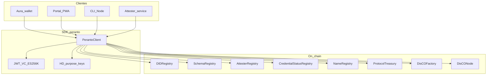

---

## 2. Contratos de registro (identidad SSI)

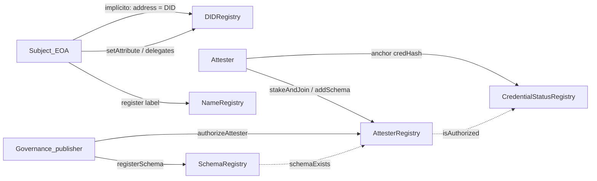

| Contrato | Escrituras clave | Lecturas clave |
|----------|------------------|----------------|
| `DIDRegistry` | `setAttribute`, `addDelegate`, `deactivate` | `identityOwner`, resolve vía storage/logs |
| `SchemaRegistry` | `registerSchema` (publishers) | `schemaExists`, `getSchema` |
| `AttesterRegistry` | `stakeAndJoin`, `addSchema`, `startUnbond`, `withdraw` | `isAuthorized`, `stakeOf`, `minStake` |
| `CredentialStatusRegistry` | `anchor`, `anchorV2`, `revoke`, `isValid` | `status`, `statusV2`, `anchorFee` |
| `ComplianceZkVerifier` | `verifyGate`, `setPolicy`, `setGroth16` | `previewValid`, `minScoreBps`, `allowlistRoot` |
| `NameRegistry` | `register`, `release` | resolve label → address |

---

## 3. Flujo SDK: emitir y anclar una VC

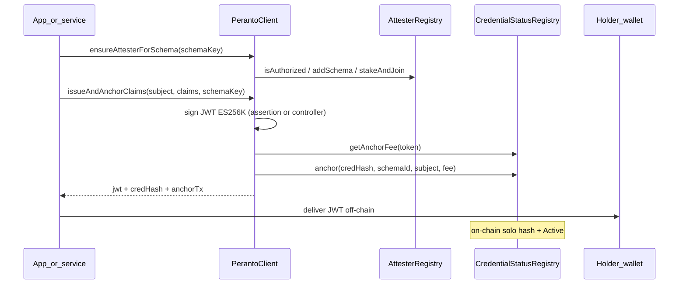

Métodos SDK: `ensureAttesterForSchema`, `issueAndAnchorClaims`, `verifyCredential`, `revoke`, `getSchema`, `getAnchorFee`.

Constantes: `SCHEMA_KEYS`, `CREDENTIAL_STATUS` en `@peranto/sdk`.

---

## 4. Flujo SDK: verificar (curator / dapp)

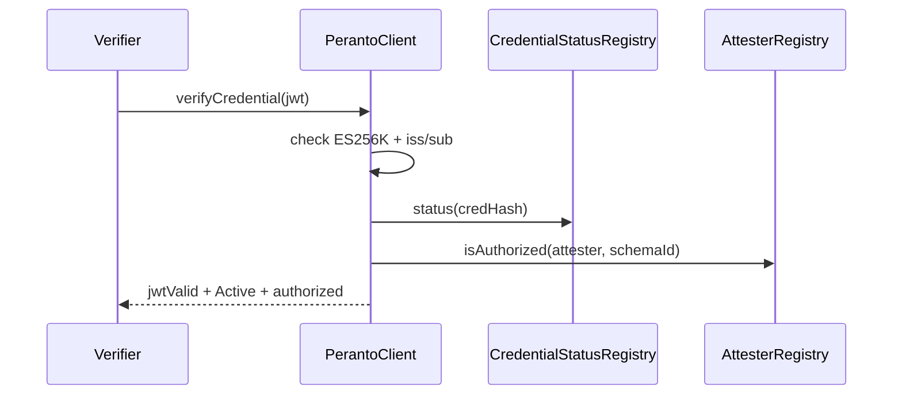

El verifier **no** recibe PDF ni biometría; solo JWT + estado on-chain.

---

## 5. Attesters: join, multi-schema, unbond

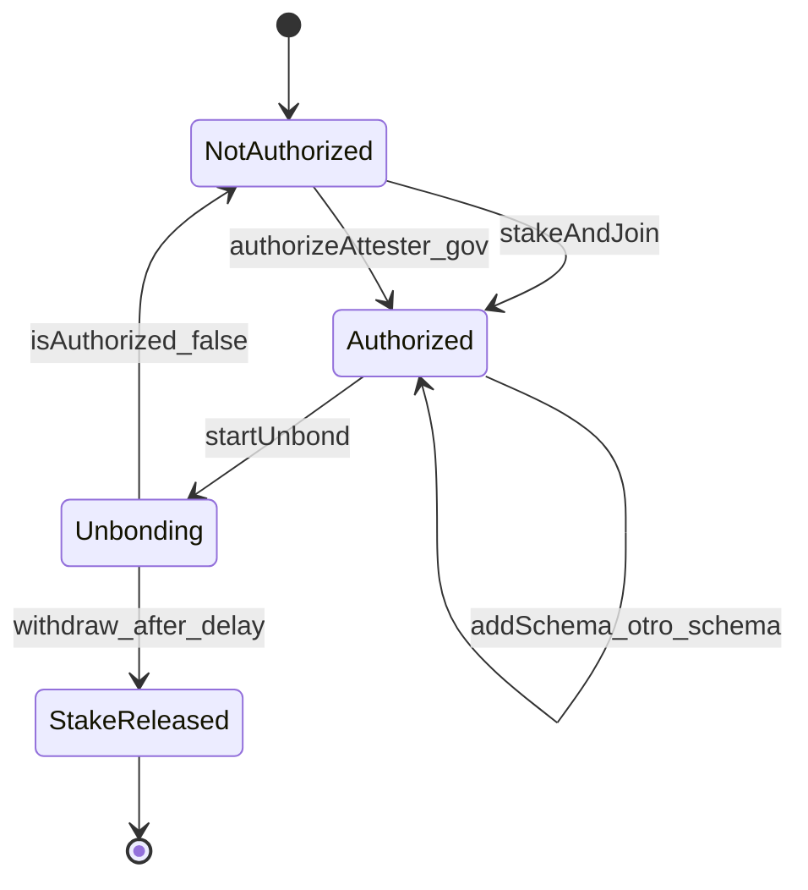

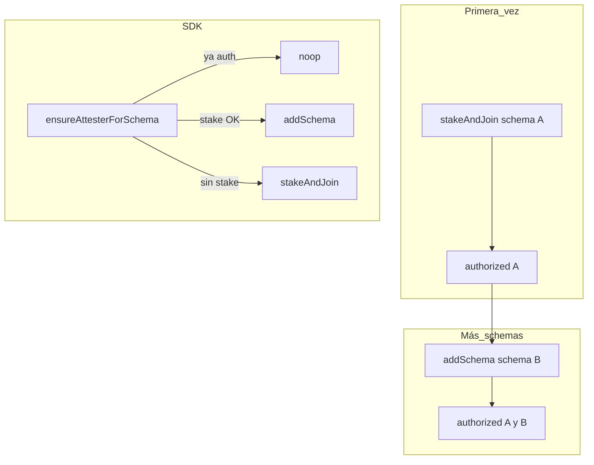

---

## 6. Tesorerías y valor DisCO

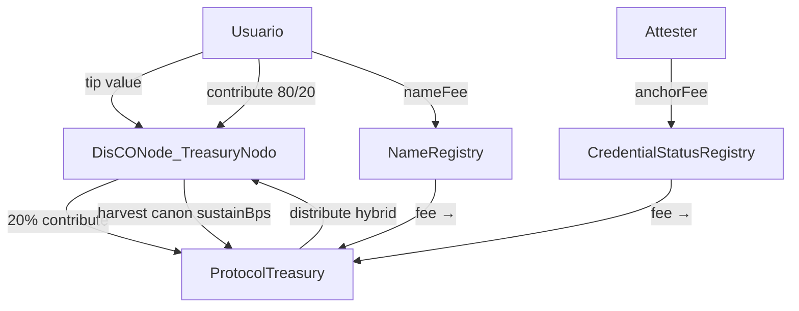

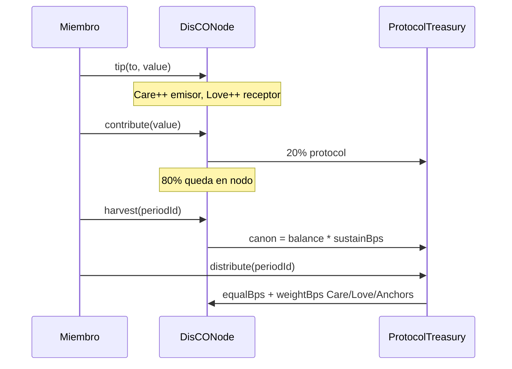

Detalle de parámetros: [tokenomics.md](./tokenomics.md).

---

## 7. Aura: acciones del popup vs provider dapp

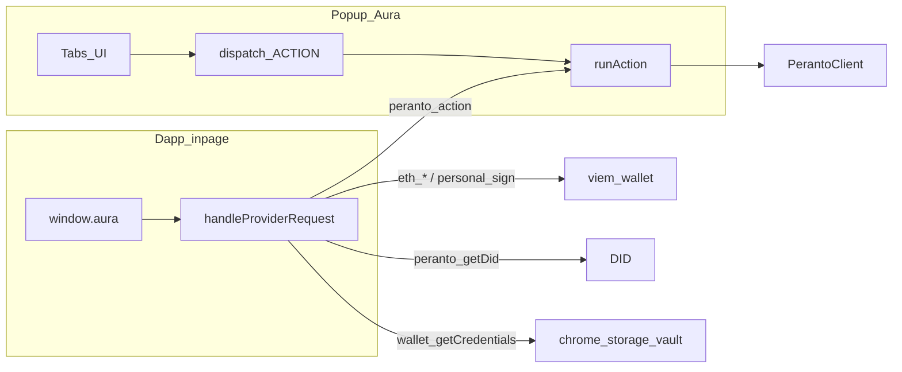

| Superficie | Ejemplos | Quién firma |
|------------|----------|-------------|
| Popup `ACTION` | `attester.join`, `vc.issue`, `disco.tip` | Identidad Aura en storage |
| EIP-1193 | `eth_sendTransaction`, `personal_sign` | Misma PK EVM |
| Peranto | `peranto_getDid`, `peranto_action`, `wallet_getCredentials` | Popup / SW |

### 7.1 Domain linkage (obligatorio para APIs sensibles)

Antes de `wallet_getCredentials`, `peranto_saveCredential` / `peranto_requestCredential` o `peranto_action` privilegiado, Aura **MUST** verificar el Well-Known DID Configuration del origen de la página (perfil Sporran/KILT adaptado a `did:peranto`). Spec: [well-known-did-configuration.md](./well-known-did-configuration.md).

### Holder Save / Share (Sporran-like)

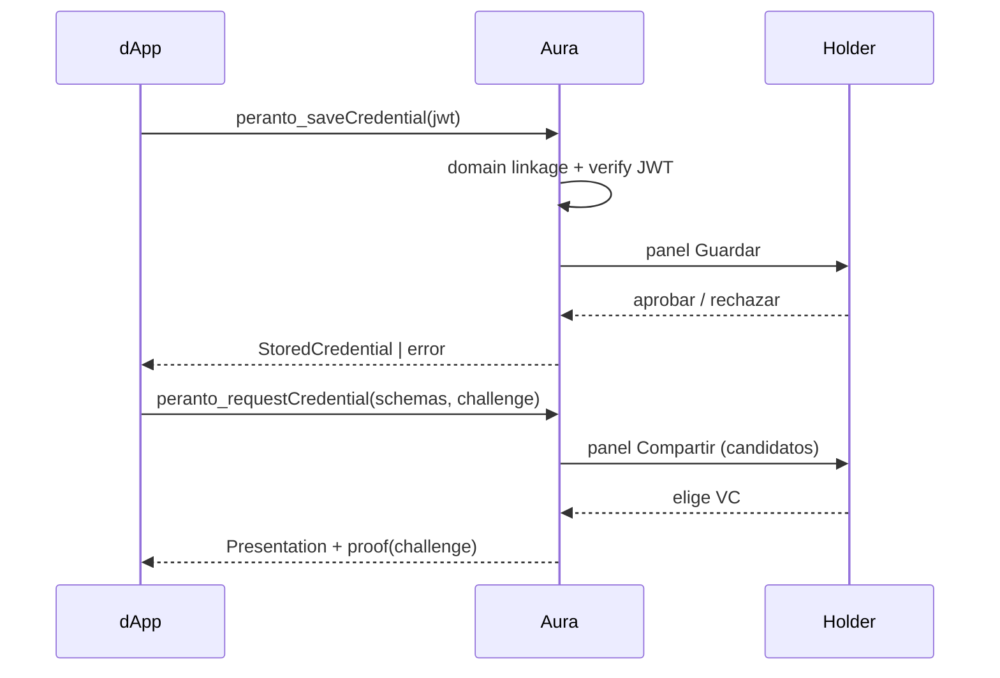

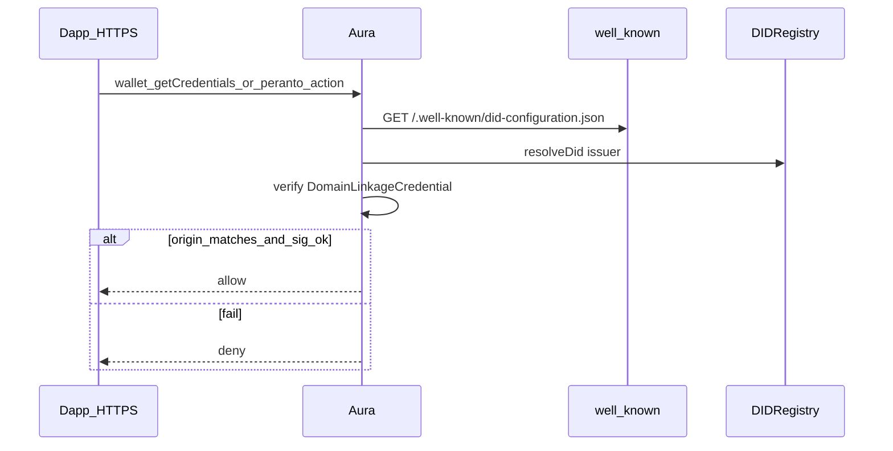

On-chain: servicio `LinkedDomains` en el DID del servicio (hint). Off-chain: DomainLinkageCredential firmado por ese DID.

**Aura (implementado):** el content script obtiene el well-known same-origin; el provider exige `verifyDomainLinkage` antes de APIs sensibles; cache ~1h en “Sitios de confianza” (Red).

---

## 8. Compliance gate (producto encima del protocolo)

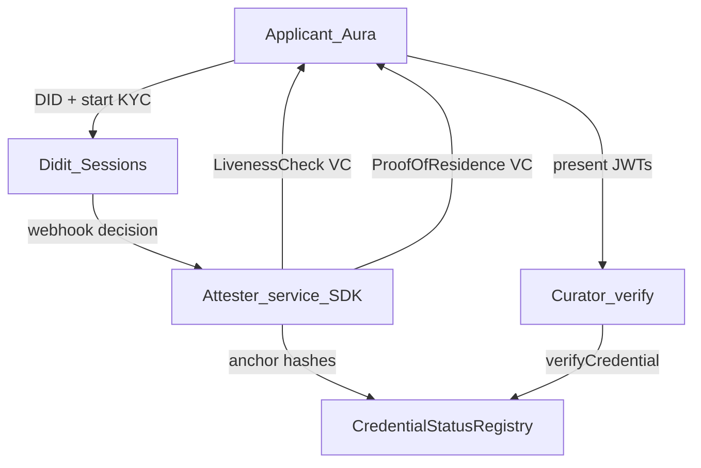

Ver [compliance-residence-liveness.md](./compliance-residence-liveness.md). El attester de producción es **servicio Node + SDK**, no la extensión Aura del usuario.

---

## 9. Mapa rápido SDK → contrato

| `PerantoClient` | Contrato |
|-----------------|----------|
| `resolveDid`, delegates, services | `DIDRegistry` |
| `registerSchema`, `getSchema`, `setSchemaPublisher` | `SchemaRegistry` |
| `stakeAndJoin`, `addSchema`, `ensureAttesterForSchema`, `authorizeAttester`, `revokeAttester`, `startUnbond`, `withdrawAttesterStake` | `AttesterRegistry` |
| `issueAndAnchorClaims`, `verifyCredential`, `revoke`, `getAnchorFee`, `getCredentialStatus`, `isCredentialValid`, `getCredentialStatusV2` | `CredentialStatusRegistry` |
| `proveComplianceGateAlgebraic`, `verifyComplianceGatePublic`, `computeClaimsCommitment` | compliance / ZK (see `@peranto/zk-compliance`) |
| `registerName`, `resolveName` | `NameRegistry` |
| `createNode`, `tip`, `contribute`, `harvest`, `distribute`, scores | `DisCOFactory` / `DisCONode` / `ProtocolTreasury` |
