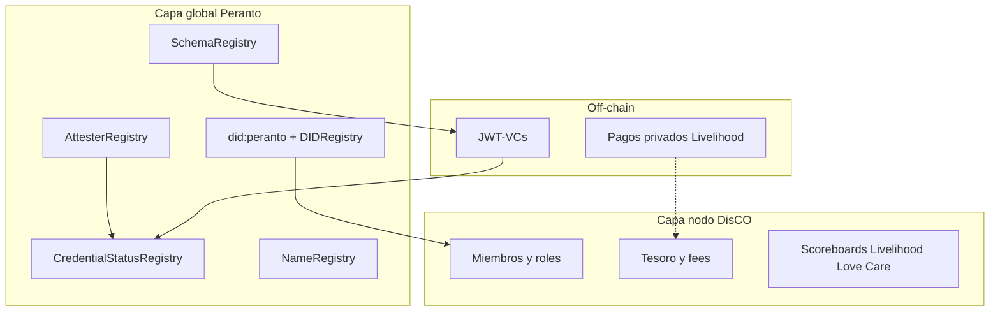

# Protocolo Peranto — Whitepaper inicial y glosario

**Estado:** borrador v0.3  
**Fecha:** 2026-07-14  
**Autores:** Peranto  

Documento canónico de **visión y diseño aterrizado** del protocolo (identidad SSI + núcleo económico DisCO en código). Para detalle normativo del método DID, ver [did-peranto-method.md](./did-peranto-method.md). Para fees y stake, ver [tokenomics.md](./tokenomics.md). Para despliegue en Paseo, ver [paseo-deploy.md](./paseo-deploy.md). Para **privacidad mínima y operaciones cooperativas**, ver [research-privacy-cooperatives.md](./research-privacy-cooperatives.md).

---

## 1. Resumen

El **protocolo Peranto** es una infraestructura de identidad autosoberana (*self-sovereign identity*, SSI) y credenciales verificables (*verifiable credentials*, VC) orientada a cooperativas, labs y aplicaciones de propósito (eco-testing, traducción, montaña, movilidad, etc.).

Combina:

1. **Capa global on-chain** — identificadores `did:peranto`, registros (*registries*) de schemas, attesters, estado de credenciales y nombres, desplegables en EVM local y en **Paseo** (Polkadot Hub TestNet / PolkaVM vía `pallet-revive`).
2. **Credenciales off-chain** — el contenido sensible de las VC viaja como JWT-VC firmado; la chain solo ancla hashes y estado (Active / Revoked).
3. **Capa de nodo cooperativa (DisCO)** — opcional por organización: miembros, tesoro embebido en `DisCONode`, fees 80/20, tips Love/Care, `harvest` / `distribute` vía `ProtocolTreasury`.

No todo puede ser *commons*. El protocolo asume una frontera explícita entre **operaciones internas** (reproducir el colectivo) y **operaciones externas** (cliente, mercado, otras DisCOs, público).

---

## 2. Problema

- Tras el cierre de referencias como KILT, hace falta una capa SSI **usable** sobre sustratos actuales (EVM / PVM), con método propio y registries abiertos.
- Muchas organizaciones autónomas descentralizadas (*DAO*) priorizan incentivos, stake y “trustlessness”, y dejan fuera el **cuidado (*care*)**, el trabajo invisible y la generación de bienes comunes.
- Si se fuerza que “todo sea commons”, se agota quien sostiene el trabajo pagado (*livelihood*) y quien cuida el organismo colectivo.
- Las plataformas extractivas concentran custodia de identidad y de datos. Peranto parte de **posesión (*possession-first*)**: las claves y los claims viven en el sujeto o en su dispositivo siempre que sea posible.

---

## 3. Principios

1. **Possession-first** — el sujeto controla claves y presentaciones; la chain no custodia el payload de la VC.
2. **Distributed over merely decentralized** — nodos que pueden aportar y recibir; no solo “varios centros”.
3. **Cooperative over merely autonomous** — las reglas las acuerda gente; el contrato ejecuta, no sustituye juicio ético.
4. **Trustless + trustworthy** — verificación criptográfica como piso; reputación relacional y cooperativa como complemento.
5. **Frontera interno / externo** — no todo es público ni commons; lo privado legítimo (pagos, PII, deliberación) puede quedar off-chain.
6. **Tres flujos de valor** — Livelihood, Love (commons), Care (reproducción + cuidado mutuo / federación).
7. **Sin token propio en el MVP** — peso económico en el token nativo de la red (p. ej. PAS en Paseo).

Inspiración de gobernanza y valor: [DisCO Manifesto](https://www.disco.coop/) (*Distributed Cooperative Organizations*), adaptado a identidad y VCs — no una copia literal del modelo Guerrilla Translation.

---

## 4. Arquitectura en capas



| Capa | Qué resuelve | Estado |
|------|----------------|--------|
| Global Peranto | Identidad, schemas, quién puede anclar, status, nombres | **Implementada** (contratos + SDK/CLI) |
| Off-chain VC / pagos | Claims, privacidad, liquidación privada | **Implementada** (JWT-VC); pagos = fuera de protocolo |
| Nodo DisCO | Políticas por cooperativa, tesoro, scoreboards | **Implementado** (`DisCONode` + factory + tests) |

Livelihood / Love / Care **no** son tres máquinas virtuales ni tres registries globales obligatorios. Son **tipos de evidencia (schemas)** y, en el nodo, **contadores y reglas de fee**. La identidad es una sola: `did:peranto`.

---

## 5. Operaciones internas vs externas

| | **Operación interna** | **Operación externa** |
|--|------------------------|------------------------|
| Ámbito | Dentro del nodo DisCO | Cliente, otra DisCO, público, mercado |
| Ejemplos | Onboarding, asamblea, mediación, mentoría entre miembros, mantenimiento de protocolos | Encargo pagado, muestreo pro-bono público, resultado eco para un cliente, ayuda a otra cooperativa |
| Qué suele anclarse | Membresía, Care interno, actualizaciones de rol | VC de trabajo, CommonsWork, fees al tesoro, reputación federada |
| Qué suele quedar privado | Deliberación, datos personales de miembros, actas sensibles | Importe completo del pago Livelihood al trabajador; PII del cliente |

La DisCO **regula la frontera**: qué se privatiza, qué se aporta al commons, qué fracción del valor externo vuelve al tesoro.

---

## 6. Tres flujos de valor

### 6.1 Livelihood (sustento / mercado)

Trabajo que sostiene ingreso. Ejemplo traducción: el cliente paga **en privado** al miembro con credencial; una **fracción** acordada va al tesoro de la DisCO. Ejemplo eco-testing: informe de laboratorio cobrado a un cliente industrial; tip/`anchorFee` puede alimentar tesoro o care pool.

On-chain típico: VC + ancla de hash; opcional registro de fee. **No** es obligatorio publicar el monto del sueldo.

### 6.2 Love (commons / pro-bono)

Trabajo que **genera commons** (datos abiertos, guía pública, traducción pública). Puede ser ad honorem. Un diseño posible (política del nodo): el promotor paga un fee medio al tesoro; se acreditan puntos.

**Tips:** quien **recibe** un tip on-chain suma **Love** (individuo y, agregado, su nodo). Schema típico: `CommonsWork` y/o `TipReceipt` (opcional).

### 6.3 Care (cuidado)

- **Care interno:** reproducir el colectivo y cuidar personas del nodo.
- **Care / solidaridad:** ayudar a otra DisCO; también quien **da** un tip suma **Care** (cuidar el ecosistema).

On-chain: contadores + schema `CareContribution` y/o tip; scoreboards en el nodo.

```text
Externo pagado      → Livelihood
Externo commons     → Love  (incluye recibir tips)
Interno / dar tip   → Care  (reproducción + cuidado al dar)
Externo a otra DisCO → federación (links/anclas cruzadas)
```

---

## 7. Componentes on-chain actuales

Implementados en [`contracts/`](../contracts/):

| Contrato | Función |
|----------|---------|
| **DIDRegistry** | Identidad estilo ERC-1056: owner, delegates, attributes, deactivate. Create **implícito** (toda address es DID). Servicios DID = atributos `did/svc/<Type>`. |
| **SchemaRegistry** | Tipos de credencial inmutables (`schemaId`, hash, URI). Solo publishers autorizados. |
| **AttesterRegistry** | Autorización a anclar por schema vía `stakeAndJoin` (PAS/colateral) o `authorizeAttester` (gobernanza). Unbond / slash. |
| **CredentialStatusRegistry** | `anchor` / `revoke` / `status` del hash de la VC; fee opcional enviado on-chain a `treasury`. |
| **NameRegistry** | Alias humano (`ecolab` → address / DID). Fee de registro enviado on-chain a `treasury`. `release` libera el label (fee no se reembolsa). |

**Tesoro hoy.** El deploy configura `ProtocolTreasury` como destino de `anchorFee` / `nameFee`. Cada `DisCONode` actúa como **TreasuryNodo** (saldo nativo + `withdraw` gobernado). El flujo tip → scores → canon (`harvest`) → reparto híbrido (`distribute`) está en contratos y tests.

Método DID: `did:peranto:<network>:<address>` (sin prefijo `light`; el “light” de KILT es conceptualmente el DID implícito). Spec: [did-peranto-method.md](./did-peranto-method.md).

---

## 8. Capa DisCONode (implementada — núcleo v0.3)

Contratos: `DisCOFactory` → `DisCONode` + registro en `ProtocolTreasury`. El saldo del nodo es el **TreasuryNodo**; no hay ERC-20 propio.

| Capacidad | Contrato | Descripción |
|-----------|----------|-------------|
| **Members** | `DisCONode` | `addMember` / `removeMember` (gobernanza del nodo); creator = primer miembro |
| **Tips** | `tip(to)` | Valor completo al receptor (o al nodo si `to == this`); Care↑ emisor, Love↑ receptor; agregados de periodo |
| **Actividad 80/20** | `contribute()` | 80% permanece en nodo; 20% → `ProtocolTreasury` |
| **Anchors / federación** | `recordAnchor`, `addFederationLink` | Alimentan peso \(w_i\) y `sustainBps` |
| **Canon** | `harvest(periodId)` | `sustainBps` dinámico sobre saldo − `reserveFloor` → protocolo |
| **Reparto** | `ProtocolTreasury.distribute` | Híbrido 50% equal + 50% weighted \(w = 5C + 3L + 1A\) |
| **Disolución** | `DisCONode.dissolve(residualTo)` | Vacía miembros, envía saldo residual, `ProtocolTreasury.selfUnregister()`. **No** revoca anclas de VC — hay que `revoke` por hash. |

Peranto se despliega como **nodo peer** (`createNode("Peranto")`) en el script de deploy.

Varias DisCOs = varias instancias sobre la misma capa global Peranto.

### 8.1 Sostenimiento “solo protocolo” (sin ingresos off-chain)

Si Peranto-organización no tiene SaaS, pilots ni grants, el protocolo se sostiene **solo** con fees on-chain. Los contratos pueden seguir vivos aunque la marca/equipo desaparezca; el riesgo de **tragedia de los comunes** no es que el bytecode se apague, sino que falte **recirculación** de valor entre nodos y se desalinee el ecosistema.

Por eso el diseño aterrizado incluye:

1. **Fees hacia los nodos** (`TreasuryNodo` embebido) — la mayor parte del valor de uso.
2. **Acumulación temporal** en `ProtocolTreasury` — split de actividad + canon.
3. **Redistribución periódica** del `ProtocolTreasury` **de vuelta a los nodos** (no a DIDs individuales), con regla **híbrida 50/50**.
4. **Peranto** participa como **un nodo peer** (`DisCONode` Peranto), misma regla que el resto — no como dueño del peaje.

El `ProtocolTreasury` no es una caja de renta perpetua: es un **commons temporal** del ecosistema que se vuelve a repartir.

#### Flujos

```text
Actividad (anchor / name / tip Love-Livelihood)
        │
        ├─ 80% → TreasuryNodo (DisCO local)
        └─ 20% → ProtocolTreasury

TreasuryNodo (saldo)
        │
        └─ canon 2%/periodo ≈ mes (bloques) → ProtocolTreasury

ProtocolTreasury (acumulado del periodo)
        │
        └─ distribute() al cierre del periodo
              → 50% equal entre nodos elegibles
              → 50% weighted por puntajes del periodo
              → cada share llega al TreasuryNodo_i
                 (incl. nodo peer Peranto)
```

#### Split de actividad (80 / 20)

Sobre cada fee de uso que atraviesa el nodo o la factory: **80% al nodo**, **20% al `ProtocolTreasury`**.

#### Canon mensual 2% sobre el tesoro del nodo

- Al cerrar cada periodo (~30 días en **tiempo de bloque**), `harvest()`: transferir `balance * sustainBps / 10000` (inicial `sustainBps = 200` → 2%) a `ProtocolTreasury`.
- `periodBlocks` configurable; keeper permissionless.
- `reserveFloor`: no cobrar bajo un piso (protege bucket Care).
- Opt-out: salir de la factory Peranto pierde elegibilidad en el reparto y en la federación; el bytecode local puede seguir.

#### Redistribución híbrida del ProtocolTreasury (normativa)

Al cierre del mismo periodo (o justo después del harvest), `distribute()` reparte **todo el saldo repartible** del `ProtocolTreasury` entre los **TreasuryNodo** elegibles:

| Tramo | Bps | Regla |
|-------|-----|--------|
| Equal | `equalBps = 5000` (50%) | \(1/N\) entre nodos elegibles |
| Weighted | `weightBps = 5000` (50%) | Proporcional a \(w_i\) |

**Peso del nodo \(i\) en el periodo:**

\[
w_i = c_C \cdot Care_i + c_L \cdot Love_i + c_A \cdot Anchors_i
\]

| Coeficiente | Valor inicial | Métrica |
|------------|---------------|---------|
| \(c_C\) | **5** | Puntos Care del nodo en el periodo |
| \(c_L\) | **3** | Puntos Love / CommonsWork del nodo |
| \(c_A\) | **1** | Anclas (actividad) del nodo |

Si \(\sum w_i = 0\), el tramo weighted se reparte también en equal entre elegibles.

**Nodo elegible** (todos los requisitos):

1. Registrado en la factory Peranto.
2. Canon del periodo al día (harvest ejecutado o saldo bajo floor).
3. Umbral anti-Sybil: ≥ 1 miembro **o** ≥ 1 ancla **o** ≥ 1 Care/Love registrado en el periodo.

**Peranto** = nodo peer elegible con su propio `TreasuryNodo`; no hay share especial fuera de la fórmula.

Cada DisCO decide **después** cómo usar lo recibido en su tesoro (Care interno, reservas, payouts) según su asamblea — el protocolo no reparte a personas.

#### Si “Peranto desaparece”

| Qué permanece | Qué debe estar on-chain |
|---------------|-------------------------|
| Registries, nodos, VCs | — |
| Harvest + distribute | Parámetros y elegibilidad en contratos |
| Destino del pool | Redistribución a nodos; gobernanza solo para actualizar bps/coeficientes, no para vaciar a una EOA |

#### Nota económica

El 2% mensual compuesto es fuerte; `reserveFloor`, buckets y gobernanza de `sustainBps` lo mitigan. El 50/50 evita tanto el free-rider puro (solo equal) como el monocolor “quien más ancla se lleva todo” (solo weighted).

#### Tips, reputación y `sustainBps` dinámico

**Tip on-chain** (`tip(to, amount)` o equivalente en el nodo): persona→persona, persona→nodo, nodo→nodo. Mueve PAS (o unidad de tip) y actualiza contadores del periodo.

| Quién | Puntaje |
|-------|---------|
| **Receptor** del tip | **Love** ↑ (DID y agregado al nodo del receptor) |
| **Emisor** del tip | **Care** ↑ (DID y agregado al nodo del emisor) |

**Federación / encaje:** anclas o colaboraciones con otros nodos del protocolo en el periodo aumentan `federationLinks` del nodo (encaje en el grafo).

**`sustainBps` dinámico** (canon del periodo; valores iniciales):

| Condición del nodo | `sustainBps` | Canon |
|--------------------|--------------|-------|
| **Integrado:** Love recibido en el periodo **y/o** `federationLinks ≥ K` | `200` | 2% |
| **Nuevo** (&lt; `N` periodos desde el alta) **o aislado** (sin Love recibido **y** `federationLinks = 0`) | `500` | 5% |
| **Muy integrado** (opcional): Love recibido **y** `federationLinks ≥ 2K` | `100` | 1% |

Parámetros iniciales: `K = 1`, `N = 3` periodos de gracia con evaluación de aislamiento tras `N` (durante gracia un nodo nuevo sin encaje puede aplicar ya `500` salvo política de fábrica que permita solo baseline el primer periodo — **norma:** nuevos sin Love ni links → `500`).

El fee dinámico mira **agregados de nodo**, no direcciones individuales.

#### Capas: chain vs credenciales verificables (VC)

```text
1) Hecho económico on-chain   tip / fee / harvest / distribute  → PAS + contadores
2) Evidencia VC (JWT)         contexto, roles, historial portable
3) Ancla opcional             credHash en CredentialStatusRegistry
```

| Momento | On-chain | VC |
|---------|----------|-----|
| Tip | Transfer + Love(receptor) + Care(emisor) | Opcional [`TipReceipt`](../schemas/TipReceipt.v1.json); o `CareContribution` / reconocimiento Love |
| Livelihood | Fee split 80/20 | VC de entrega (`EcoTestResult`, etc.) |
| Membresía | Mapping en DisCONode | VC `Member` |
| Federación | Contador links | VC de colaboración (opcional) |
| Canon / distribute | `sustainBps`, `harvest`, `distribute` | La VC **no cobra** el fee; solo justifica reputación si alguien verifica off-chain |

No es obligatorio emitir una VC por cada micro-tip si el tip ya está en el contrato; la VC aporta interoperabilidad, disputa y presentación en Aura Wallet.

---

## 9. Credenciales y schemas

### Existente

- **`peranto:EcoTestResult:v1`** — resultado de prueba ecológica/lab ([JSON Schema](../schemas/EcoTestResult.v1.json)). Claims: `sampleId`, `testType`, `result`, `unit`, `labName`, `testedAt`.

### Plantillas lógicas (fase schemas)

| Schema ID lógico | Valor | Uso |
|------------------|-------|-----|
| `peranto:Member:v1` | Rol | Membresía en un DisCONode |
| `peranto:CommonsWork:v1` | Love | Artefacto o trabajo commons |
| `peranto:CareContribution:v1` | Care | Cuidado interno o federado |
| `peranto:TipReceipt:v1` | Tip | Recibo portable de tip ([JSON Schema](../schemas/TipReceipt.v1.json)) |
| `peranto:EcoTestResult:v1` | Livelihood / técnico | Demo vertical actual (MVP) |

Los claims detallados viven off-chain; on-chain: `schemaId` + `credHash` + subject + attester.

---

## 10. Redes

| Red | Chain ID | DID ejemplo | Token gas |
|-----|----------|-------------|-----------|
| Hardhat / localhost | `31337` | `did:peranto:hardhat:0x…` | ETH test |
| Paseo Hub TestNet | `420420417` | `did:peranto:paseo:0x…` | PAS |
| Base | `8453` | `did:peranto:base:0x…` | ETH |
| Base Sepolia | `84532` | `did:peranto:baseSepolia:0x…` | ETH |
| Arbitrum One (EVM) | `42161` | `did:peranto:arbitrum:0x…` | ETH |
| Arbitrum Sepolia (EVM) | `421614` | `did:peranto:arbitrumSepolia:0x…` | ETH |

> **Stylus:** los contratos actuales son Solidity sobre Nitro EVM. Stylus (Rust/WASM) es un runtime distinto — ver [multi-chain-deploy.md](./multi-chain-deploy.md).
| ETH-RPC Paseo | — | — | `https://eth-rpc-testnet.polkadot.io/` |

---

## 11. Roadmap

| Fase | Entrega |
|------|---------|
| **MVP identidad (hecho en repo)** | 5 registries, SDK/CLI, JWT-VC EcoTest, tests, método DID, whitepaper |
| **v0.2 schemas** | Registrar/usar `Member`, `CommonsWork`, `CareContribution`; TipReceipt registrado en deploy |
| **v0.3 economía DisCO (núcleo en repo)** | `DisCONode`, `ProtocolTreasury`, `DisCOFactory`, tip/contribute/harvest/distribute, SDK/CLI `disco *` |
| **Producto** | Aura Wallet; drivers de resolve; registro opcional W3C DID Extensions |

---

## 12. Fuera de alcance (v0.3 núcleo)

- Token ERC-20 “PERANTO” propio.
- Confianza 100 % trustless sin capa humana.
- Claims o PII completos en storage on-chain.
- Slash automático por disputas políticas.
- Sustituir asambleas o derecho cooperativo local por el contrato.
- Payouts automáticos a DIDs individuales desde `ProtocolTreasury` (solo nodos).
- Emisión automática de TipReceipt VC en cada tip (schema registrado; flujo CLI opcional pendiente).

---

## 13. Revisión del repo como MVP

**Veredicto:** el repo cubre **identidad SSI + anclas** y el **núcleo económico DisCO** (tesoros, tips, canon, reparto). Faltan producto wallet, más schemas de membresía/care y demos Paseo end-to-end.

| Área | Estado en el repo |
|------|-------------------|
| `DIDRegistry`, `SchemaRegistry`, `AttesterRegistry` (stake), `CredentialStatusRegistry`, `NameRegistry` | **Implementado** + tests Hardhat |
| SDK `@peranto/sdk` + CLI (DID, stake, issue/verify/revoke, names) | **Implementado** |
| Deploy scripts Hardhat / config Paseo | **Implementado** (incluye treasuries + nodo Peranto) |
| Schema JSON `EcoTestResult` + TipReceipt | **Implementado** (stubs; TipReceipt on-chain en deploy) |
| `DisCONode`, `ProtocolTreasury`, `DisCOFactory` | **Implementado** + tests |
| `tip()`, scores Love/Care, `harvest` / `distribute`, `sustainBps` dinámico | **Implementado** |
| Split 80/20 y reparto híbrido 50/50 | **Implementado** (`contribute` + `distribute`) |
| CLI `disco create|tip|contribute|harvest|distribute|scores` | **Implementado** |

Frontera operativa: se puede demostrar tip → Care/Love → contribute 80/20 → harvest → distribute en Hardhat, además del flujo SSI EcoTest.
---

## Apéndice A — Glosario

**Anchor (*ancla*)**  
Registro on-chain del hash de una VC (`credHash`) en `CredentialStatusRegistry`, con schema, subject y attester. No almacena el JWT.

**Attester**  
Actor autorizado a anclar (y usualmente a firmar) VCs de uno o más schemas. Entra por `stakeAndJoin` o por autorización de gobernanza.

**Care**  
Flujo de valor de cuidado: reproducción del colectivo; solidaridad; y puntos al **emisor** de un tip.

**Commons**  
Recurso o práctica de custodia comunitaria a largo plazo (datos abiertos, schemas compartidos, traducciones públicas, etc.). No todo el trabajo del protocolo es commons.

**Credential Status**  
Estado on-chain de una credencial: None, Active, Revoked. Contrato: `CredentialStatusRegistry`.

**DID (*Decentralized Identifier*)**  
Identificador descentralizado según W3C DID Core. En Peranto: `did:peranto:<network>:<address>`.

**did:peranto**  
Método DID del protocolo. Create implícito; enriquecimiento opcional vía `DIDRegistry`.

**DisCO (*Distributed Cooperative Organization*)**  
Enfoque de organización cooperativa distribuida orientada a commons, cuidado y contabilidad de valor abierta (referente: DisCO.coop). Inspiración de gobernanza para nodos Peranto.

**DisCONode**  
Instancia de cooperativa/lab sobre la capa global: miembros, tesoro, fees, scoreboards Livelihood/Love/Care. Diseño aterrizado; código pendiente.

**Federación**  
Relación entre nodos DisCO (interoperar schemas, ayuda mutua, reputación cruzada) sin un único centro extractivo. Contador `federationLinks` alimenta `sustainBps` dinámico.

**Holder**  
Quien custodia y presenta la VC (a menudo el *subject* o su representante).

**Issuer**  
Quien firma la VC. En este protocolo suele coincidir con el attester que ancla.

**Livelihood**  
Flujo de valor de mercado/sustento: trabajo pagado, a menudo con liquidación privada y tip al tesoro.

**Love**  
Flujo commons / pro-bono; y puntos al **receptor** de un tip (individuo y agregado al nodo).

**NameRegistry**  
Registro de etiquetas humanas (`a-z0-9-`) asociadas a una address/DID. Alias; no sustituye al DID.

**Operación externa**  
Interacción con actores fuera del nodo (cliente, público, otra DisCO, mercado).

**Operación interna**  
Actividad de reproducción y cuidado dentro del nodo.

**ProtocolTreasury**  
Tesoro global del ecosistema: recibe el 20% de actividad y el canon. Commons **temporal**: `distribute()` lo redistribuye a `TreasuryNodo` elegibles (regla híbrida). Gobernanza on-chain solo para parámetros.

**Reparto híbrido**  
50% equal (`equalBps = 5000`) + 50% weighted \(w_i = 5\cdot Care + 3\cdot Love + 1\cdot Anchors\) (`weightBps = 5000`). Destino = tesoros de nodo; Peranto es nodo peer.

**Schema**  
Definición tipada de una clase de credencial (`schemaId`, hash del documento, URI). Inmutable una vez registrada; versiones nuevas = nuevo id.

**Stake**  
Colateral nativo bloqueado para entrar como attester. Desincentiva spam; no equivale a “mérito moral”.

**Subject**  
Sujeto del que habla la VC (`credentialSubject.id`), tipicamente un DID.

**sustainBps dinámico**  
Tasa del canon periódico del nodo: `200` (integrado), `500` (nuevo/aislado), opcional `100` (muy integrado), según Love recibido y `federationLinks`.

**Tesoro (*treasury*)**  
`TreasuryNodo` (por DisCO) o `ProtocolTreasury` (commons temporal). El nodo retiene ~80% del uso; aporta canon; recibe share del reparto híbrido. Demos MVP pueden usar EOA temporal.

**Tip**  
Transferencia on-chain de apoyo/reconocimiento (`tip(to, amount)`). Receptor → Love ↑; emisor → Care ↑. Opcionalmente documentable con VC `TipReceipt`.

**Trustless / Trustworthy**  
Extremos del espectro de confianza: verificación sin conocer a la contraparte vs confianza relacional/cooperativa. El protocolo usa ambos.

**VC (*Verifiable Credential*)**  
Credencial verificable (W3C). En el MVP: JWT firmado ES256K con payload `vc`. Portable; no sustituye tip/fee on-chain.

**Verifier**  
Quien comprueba firma, issuer/attester autorizado, schema y status on-chain (y, fuera del MVP, reputación cooperativa).

---

## Referencias

- W3C DID Core — https://www.w3.org/TR/did-core/
- W3C Verifiable Credentials — https://www.w3.org/TR/vc-data-model/
- ERC-1056 (lightweight identity) — https://eips.ethereum.org/EIPS/eip-1056
- DisCO Manifesto — https://www.disco.coop/
- Peranto — https://peranto.app/
