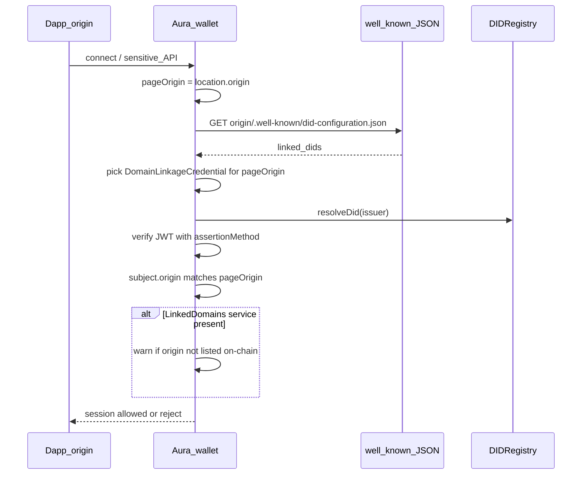

# Well-Known DID Configuration (Peranto profile)

**Status:** normative profile v0.1 (documentation; SDK/Aura enforcement TBD)  
**Aligns with:** [DIF Well-Known DID Configuration](https://identity.foundation/.well-known/resources/did-configuration/)  
**Method:** [did-peranto-method.md](./did-peranto-method.md)  
**Flows:** [architecture-flows.md](./architecture-flows.md) § Domain linkage

This document standardizes how a **dapp / attester / verifier origin** proves control of a web origin to **Aura** (and other Peranto wallets), analogous to KILT Sporran’s domain-linkage check (“server certificate” for the site).

---

## 1. Problem

Without origin binding, a malicious page can:

- Impersonate a known attester/verifier DID in RPC messages
- Request credentials or `peranto_action` from Aura on a phishing origin

Domain linkage binds **HTTPS origin ↔ `did:peranto:…`** so the wallet only trusts sessions whose origin matches a credential signed by that DID.

---

## 2. Actors

| Actor | Role |
|-------|------|
| **Service DID** | Attester, verifier, or dapp operator (`did:peranto:<network>:<address>`) |
| **Origin** | Exact web origin (`https://compliance.example` — scheme + host + port) |
| **Wallet (Aura)** | Fetches well-known, verifies credential, matches session DID, then allows sensitive APIs |
| **User** | Approves connection after wallet shows verified origin + DID |

---

## 3. On-chain hint (recommended)

Publish a DID Document service so resolvers and wallets can discover the claimed origin:

| Field | Value |
|-------|--------|
| Attribute name | `did/svc/LinkedDomain` or `did/svc/LinkedDomain.<slot>` |
| `type` | `LinkedDomains` (DIF) |
| `serviceEndpoint` | Origin string or array of origins, e.g. `"https://compliance.example"` |

Example JSON value stored on-chain:

```json
{
  "type": "LinkedDomains",
  "serviceEndpoint": ["https://compliance.example"]
}
```

Rules:

- Origins MUST be absolute and include scheme (`https` required in production; `http://localhost` MAY be allowed in development).
- The well-known file (below) is **authoritative** for wallet trust; the on-chain service is a **discovery / UX hint** and SHOULD be consistent with it.
- Wallets MUST NOT treat `LinkedDomains` alone as proof of control (anyone could claim a URL without the signed credential).

---

## 4. Well-known resource

### URL

```
{origin}/.well-known/did-configuration.json
```

### HTTP

| Requirement | Rule |
|-------------|------|
| Method | `GET` |
| CORS | `Access-Control-Allow-Origin: *` (or at least the wallet extension origin) so Aura can fetch from the page context / SW |
| Content-Type | `application/json` |
| TLS | Required for non-localhost origins |

### Document shape (DIF)

```json
{
  "@context": "https://identity.foundation/.well-known/did-configuration/v1",
  "linked_dids": [
    {
      "@context": [
        "https://www.w3.org/2018/credentials/v1",
        "https://identity.foundation/.well-known/did-configuration/v1"
      ],
      "type": ["VerifiableCredential", "DomainLinkageCredential"],
      "issuer": "did:peranto:paseo:0x…",
      "issuanceDate": "2026-08-12T00:00:00Z",
      "expirationDate": "2031-08-12T00:00:00Z",
      "credentialSubject": {
        "id": "did:peranto:paseo:0x…",
        "origin": "https://compliance.example"
      },
      "proof": {
        "type": "JwtProof2020",
        "jwt": "eyJ…"
      }
    }
  ]
}
```

Peranto profile constraints on each entry in `linked_dids`:

| Claim / field | Rule |
|---------------|------|
| `type` | MUST include `DomainLinkageCredential` |
| `issuer` | MUST be a `did:peranto:…` |
| `credentialSubject.id` | MUST equal `issuer` (self-issued linkage) |
| `credentialSubject.origin` | MUST equal the origin from which the file was fetched (byte-for-byte after normalization — see §5) |
| Proof | MUST be verifiable with the issuer’s **assertion** key (`#key-assertion` if published, else `#controller`) using ES256K JWT-VC as elsewhere in Peranto |
| `expirationDate` | SHOULD be set; wallets MUST reject expired credentials |

**JWT-VC encoding (preferred for Peranto):** the DomainLinkageCredential MAY be carried entirely as a JWT in `proof.jwt`, or the entry MAY be a JWT string inside `linked_dids` if implementations support DIF’s JWT form. Reference wallets MUST accept at least the `proof.jwt` envelope above.

Optional companion schema key for tooling (off-chain catalog, not required on-chain for linkage):

- Logical id: `peranto:DomainLinkage:v1`
- Claims: `origin` (required), `expiresAt` aligned with VC expiry

---

## 5. Origin normalization

Before compare, wallets MUST:

1. Parse the page origin (`location.origin`) and the `credentialSubject.origin`.
2. Reject if schemes differ, or if production scheme is not `https` (except allowlisted localhost).
3. Compare host case-insensitively; default ports omitted (`https://x.com` ≡ `https://x.com:443`).
4. Reject path/query/fragment in `origin` (origin only).

---

## 6. Wallet verification algorithm (Aura MUST)

When a dapp first requests a **sensitive** capability (`wallet_getCredentials`, `peranto_action` that writes or reads vault, or an explicit `peranto_requestSession`), Aura MUST:



### Pass criteria (all required)

1. Well-known fetch succeeds over the page origin.
2. At least one `DomainLinkageCredential` verifies cryptographically against `did:peranto` assertion keys.
3. `credentialSubject.origin` matches page origin (§5).
4. `issuer` === `credentialSubject.id`.
5. Credential not expired; issuer DID not `deactivated`.
6. Session DID presented by the dapp (if any) MUST equal `issuer` (or be an explicitly listed related DID in a future extension — v0.1: exact match only).

### Fail → deny

On any failure, Aura MUST NOT expose vault JWTs or execute privileged `peranto_action` for that origin. Read-only `eth_chainId` / account listing MAY still work for EIP-1193 UX, but credential APIs MUST fail closed.

### Caching

Wallets MAY cache a successful linkage for the origin + DID for a short TTL (e.g. 1 hour) or until `expirationDate`, and MUST re-check after DID deactivate or user “forget site”.

---

## 7. Operator checklist (attester / dapp)

1. Create service wallet → `did:peranto:<network>:<address>`.
2. Publish assertion key (`did.publishPurposeKeys` / `#key-assertion`) if using purpose keys.
3. `setDidService` with `LinkedDomains` → production origin(s).
4. Issue DomainLinkageCredential (self) with `origin` = that origin; sign with assertion key.
5. Host `/.well-known/did-configuration.json` with CORS `*`.
6. Rotate before `expirationDate`; update on-chain service if origin changes.

---

## 8. Relation to KILT / Sporran

| KILT | Peranto |
|------|---------|
| Well-Known DID Configuration (DIF) | Same DIF resource URL and DomainLinkageCredential type |
| Sporran verifies before credential API | Aura MUST verify before vault / privileged actions (§6) |
| KiltCredential2020 proofs | Peranto JWT-VC ES256K + `did:peranto` resolve |
| Service DID of attester/verifier | Same role: service DID + well-known on its HTTPS origin |

---

## 9. Implementation status

| Piece | Status |
|-------|--------|
| This profile (docs) | **Normative v0.1** |
| On-chain `LinkedDomains` service | Supported via generic `did/svc/*` |
| SDK `verifyDomainLinkage` / `issueDomainLinkageCredential` / `buildDidConfiguration` | **Implemented** (`@peranto/sdk`) |
| SDK `PerantoClient.verifyDomainLinkage` / `createDidConfigurationForOrigin` | **Implemented** |
| Aura gate on sensitive APIs | **Implemented** (`wallet_getCredentials`, `peranto_saveCredential`, `peranto_requestCredential`, `peranto_action` privilegiados, `peranto_requestSession`) |
| Aura Save / Share popups (holder consent) | **Implemented** |
| Aura trusted-sites cache (~1h) + popup “Olvidar” | **Implemented** |
| CLI `peranto did-config create --origin …` | **Implemented** |

Until Aura enforces §6, operators SHOULD still publish well-known files so the ecosystem can migrate without breaking changes.
